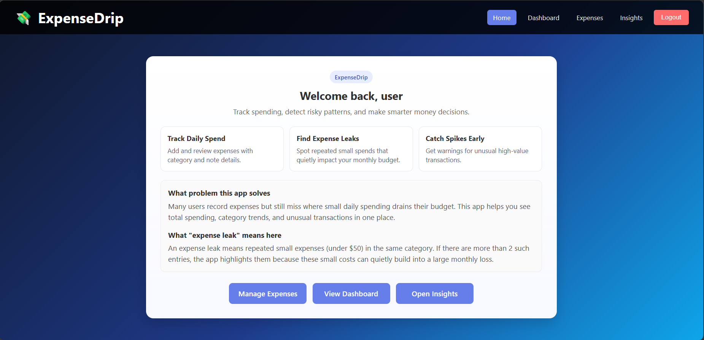

# 💸 ExpenseDrip

> **Smart Personal Expense Tracker with AI-Powered Insights**

A full-stack MERN application that doesn't just track your expenses — it analyzes your spending behavior, detects money leaks, and warns you about unusual spending spikes before they break your budget.

---

## 🎯 Why ExpenseDrip?

Most expense trackers only **record** what you spend. ExpenseDrip **understands** what you spend:

| Problem | How ExpenseDrip Solves It |
|---------|--------------------------|
| Small daily expenses go unnoticed | **Leak Detection** flags repeated small purchases |
| One big purchase throws off your budget | **Spending Spike Detection** alerts on unusual transactions |
| No idea where money actually goes | **Category Breakdown** shows spending distribution |
| Manual analysis is tedious | **Automatic insights** update in real-time on the dashboard |

---

## 🚀 Features

### 🔐 Authentication
- Secure JWT-based login & registration
- Passwords hashed with bcrypt (10 salt rounds)
- Input validation with meaningful error messages

### 💰 Expense Management
- Add, view, update, and delete expenses
- 7 spending categories: Food, Transport, Entertainment, Utilities, Shopping, Health, Other
- All expenses sorted by date (newest first)

### 📊 Smart Insights (The Game Changer)
| Insight | What It Does | Algorithm |
|---------|-------------|-----------|
| **💧 Leak Detection** | Finds repeated small expenses draining your wallet | Groups expenses <$50 by category; flags if 3+ found |
| **📈 Spending Spikes** | Warns about unusually large purchases | Statistical outlier detection: `amount > avg + 2×stdDev` |
| **📊 Category Breakdown** | Shows where your money goes | Aggregation by category with totals |
| **💵 Total Spending** | Snapshot of overall spending | Sum + count of all expenses |

---

## 🛠️ Tech Stack

**Frontend**
- React 18 with Hooks (useState, useEffect)
- React Router v6 with protected routes
- Axios with request interceptors for JWT
- CSS Modules for component styling

**Backend**
- Node.js + Express.js
- MongoDB + Mongoose ODM
- JWT Authentication
- express-validator for input sanitization
- CORS enabled

---

## 📁 Project Structure

```
Task2/
├── Backend/
│   ├── models/
│   │   ├── User.js              # User schema (username, email, password)
│   │   └── Expense.js           # Expense schema (userId, amount, category, note, date)
│   ├── routes/
│   │   ├── authRoutes.js        # Register & Login endpoints
│   │   ├── expenseRoutes.js     # CRUD operations for expenses
│   │   └── insightRoutes.js     # Analytics & insights endpoints
│   ├── middleware/
│   │   └── authMiddleware.js    # JWT verification middleware
│   ├── .env.example             # Environment variables template
│   ├── server.js                # Express app entry point
│   └── package.json
│
├── Frontend/
│   ├── src/
│   │   ├── components/
│   │   │   ├── Login.jsx        # Login page
│   │   │   ├── Register.jsx     # Registration page
│   │   │   ├── Home.jsx         # Landing page after login
│   │   │   ├── Dashboard.jsx    # Insights overview with summary cards
│   │   │   ├── ExpenseForm.jsx  # Add new expense form
│   │   │   ├── ExpenseList.jsx  # List all expenses with edit/delete
│   │   │   └── Insights.jsx     # Detailed insights page
│   │   ├── styles/
│   │   │   ├── App.css
│   │   │   ├── Auth.css
│   │   │   ├── Dashboard.css
│   │   │   ├── ExpenseForm.css
│   │   │   ├── ExpenseList.css
│   │   │   └── Home.css
│   │   ├── api.js               # Centralized API calls with auth headers
│   │   ├── App.jsx              # Main app with routing
│   │   └── index.js             # React entry point
│   ├── public/
│   │   └── index.html
│   └── package.json
│
├── Screenshots                  # Outputs
└── README.md                    # This file
```

---

## ⚡ Quick Start

### Prerequisites
- Node.js (v16+)
- MongoDB (local or MongoDB Atlas)
- npm or yarn

### 1. Clone & Navigate
```bash
cd Task2
```

### 2. Backend Setup
```bash
cd Backend

# Install dependencies
npm install

# Configure environment variables
cp .env.example .env
# Edit .env and add your MongoDB URI and JWT secret

# Start server
npm start          # Production mode
```

**Backend runs on:** `http://localhost:5000`

### 3. Frontend Setup
```bash
cd Frontend

# Install dependencies
npm install

# Start React app
npm run dev
```

**Frontend runs on:** `http://localhost:3000`

---

## 🔌 API Endpoints

### Authentication
| Method | Endpoint             | Description             | Auth Required |
|--------|----------------------|-------------------------|---------------|
| `POST` | `/api/auth/register` | Register new user       | ❌ |
| `POST` | `/api/auth/login`    | Login user, returns JWT | ❌ | 

### Expenses
| Method   | Endpoint            | Description           | Auth Required |
|----------|---------------------|-----------------------|---------------|
| `POST`   | `/api/expenses`     | Add new expense       | ✅ |
| `GET`    | `/api/expenses`     | Get all user expenses | ✅ |
| `GET`    | `/api/expenses/:id` | Get single expense    | ✅ |
| `PUT`    | `/api/expenses/:id` | Update expense        | ✅ |
| `DELETE` | `/api/expenses/:id` | Delete expense        | ✅ |

### Insights
| Method | Endpoint                           | Description           | Auth Required |
|--------|------------------------------------|-------------          |---------------|
| `GET`  | `/api/insights/category-breakdown` | Spending by category  | ✅ |
| `GET`  | `/api/insights/total-spending`     | Total amount & count  | ✅ |
| `GET`  | `/api/insights/leak-detection`     | Detect money leaks    | ✅ |
| `GET`  | `/api/insights/spending-spikes`    | Find unusual spending | ✅ |

**Auth Header Format:** `Authorization: Bearer <your_jwt_token>`

---

## 🧪 Testing with Postman

I've included a complete Postman collection for testing all APIs:

1. **Import the collection:** `Backend/ExpenseDrip-API-Collection.json`
2. **Set up environment variables** (`base_url`, `auth_token`, `expense_id`)
3. **Follow the guide:** `POSTMAN_TESTING_GUIDE.md`

The login endpoint auto-saves the JWT token to your Postman environment!

---

## 🧠 How Smart Insights Work

### 💧 Leak Detection
```
1. Filter expenses under $50
2. Group by category
3. If any category has 3+ small expenses → FLAG as leak
4. Calculate: total leaked, average per transaction, warning message
```

**Example Output:**
```json
{
  "category": "Food",
  "count": 5,
  "totalAmount": 47.50,
  "averageAmount": "9.50",
  "message": "You have 5 small expenses in Food totaling $47.50"
}
```

### 📈 Spending Spike Detection
```
1. Calculate mean of all expense amounts
2. Calculate standard deviation
3. If expense > (mean + 2 × stdDev) → FLAG as spike
4. Show deviation from average
```

**Example Output:**
```json
{
  "average": "73.12",
  "standardDeviation": "81.45",
  "spikes": [
    {
      "category": "Shopping",
      "amount": 250.00,
      "deviationFromAverage": "176.88"
    }
  ]
}
```

---

## 🎨 Screenshots

| Page      | Preview                                   |
|-----------|-------------------------------------------|
| Login     |          |
| Home      |            |
| Dashboard |  |
| Expenses  |    |
| Insights  |    |

---

## 🔮 Future Improvements

- [ ] **Data Visualization** — Charts (pie, line, bar) using Chart.js or Recharts
- [ ] **Budget Goals** — Set monthly category limits with alert notificati
- [ ] **More Insight Algorithms** — Weekly trends, seasonal comparisons, savings suggestions
- [ ] **Security Hardening** — Rate limiting, httpOnly cookies, input sanitization
- [ ] **Unit Testing** — Jest + React Testing Library for frontend, Mocha/Chai for backend
- [ ] **Mobile Responsive** — Optimize for mobile expense tracking on-the-go
- [ ] **Recurring Expenses** — Auto-track subscriptions and recurring bills

---

## 🙋‍♂️ Author

Built with 💸 and ☕ by **M.I.Fathima Shahani**

---

> *"Track it. Understand it. Stop the leaks."* — ExpenseDrip
